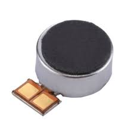
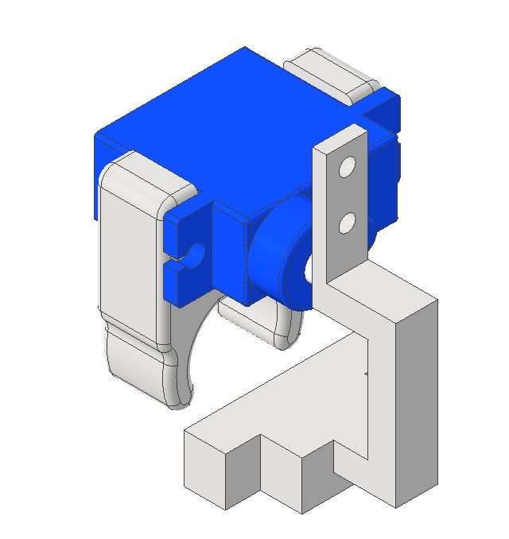
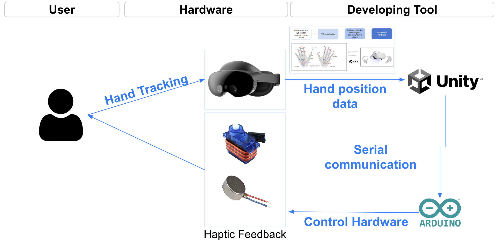
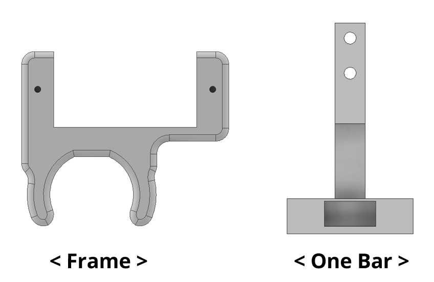
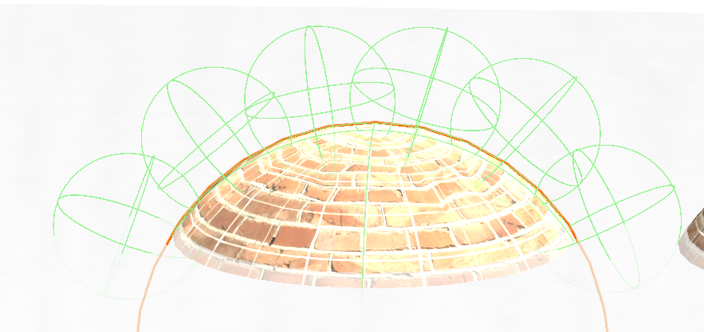

# Deep-Texture : A Foldable Haptic Ring for Shape and Texture Rendering in Virtual Reality

.png)

### Table of Contents  
- [System Diagram](#system-diagram)
- [Hardware Guidelines](#Hardware-Guidelines)
- [Software Guidelines](#Software-Guidelines)
    - [Arduino](#arduino)
    - [Unity](#unity) 

<a name="system-diagram"/>

## System Diagram

Our needed hardware is consisted of three parts

| LRA                | ServoMotor                        | 3D printing mat                 |
|:------------------:|:--------------------------------:|:-------------------------------:|
| DA7280             | SG90                              |                                 |
|  |  |  |

## Hardware Guidelines
Size of the user's hand is different, so we suggest the guidelines for a proper size of our hardware.

| Finger                              | Deep Texture Hardware                              |
|:-----------------------------------:|:--------------------------------------------------:|
|  |   |

User should measure the $x value and choose the right frame.

| Finger size   |    x     |  Hardware link |
|:-------------:|:--------:|:--------------:|
|       1       |   x<18   |  [frame_1.ipt](./hardware/Frame/frame_1.ipt)             |
|       2       |  18<x<22 | [frame_2.ipt](./hardware/Frame/frame_2.ipt)             |
|       3       |   22<x   |  [frame_3.ipt](./hardware/Frame/frame_3.ipt)             |

## Software Guidelines
### Arduino(#arduino)
Arduino code for LRA activating!   
[LRA code](./Arduino/controlling_feq.ino).   
Arduino code for Servormotor activating!   
[ServoMotor code](./Arduino/haptic_servo.ino).      

### Unity(#unity)

#### Unity setup process.  
1. Attach the collider like above image.    
2. Send the serial data(angle, freq) to arduino    

#### Unity_Arduino Serial Commuication      
[Unity_Arduino](./Serialcom.cs).       
This is simple example of serial communicate from unity to arduino  
You have to adjust the code to work properly!        
(Serialport, baudrate, Sending Receving data format)   

